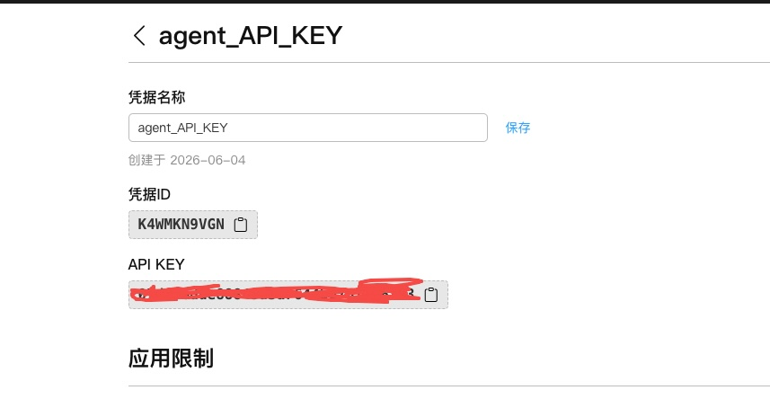

# weather-agent
weather-agent for education 

# 技术栈选择
## 2.1 推荐技术栈
1. Python 3.10+          # 编程语言
2. LangChain 0.1+       # Agent 框架
3. OpenAI API / 通义千问  # 大模型
4. FastAPI              # Web 服务（可选）

## 2.2 环境准备
### 2.2.1 第一步:创建虚拟环境
1. python3 -m venv venv
2. source venv/bin/activate
3. -- Windows 环境 , venv\Scripts\activate

### 2.2.2 第二步:配置环境变量
1. 创建 .env 文件
```
# .env
OPENAI_API_KEY=your_api_key_here
# DASHSCOPE_API_KEY=your_api_key_here --for qianwen
OPENAI_BASE_URL=https://api.openai.com/v1
# 或使用通义千问
# OPENAI_BASE_URL=https://dashscope.aliyuncs.com/compatible-mode/v1

WEATHER_API_KEY=your_weather_api_key
# 推荐：和风天气 https://dev.qweather.com/
```
### 2.2.3 第三步:安装依赖-2026年最新版
1. 创建 requirements.txt：
```python
langchain>=1.0.0
langchain-openai>=0.3.0
langchain-community>=0.3.0
python-dotenv>=1.0.0
requests>=2.31.0
dashscope>=1.20.0
```
2.  pip install -r requirements.txt
3.  或者直接安装依赖  pip install langchain langchain-openai python-dotenv requests 

# 三、实战：搭建天气查询助手
## 3.1 项目结构
```python
weather-agent/
├── .env                    # 环境变量
├── requirements.txt        # 依赖
├── tools/
│   └── weather_tool.py    # 天气查询工具
├── agent/
│   └── weather_agent.py   # Agent 主程序
└── main.py                # 入口文件
```


# 四、获取API Key 
1. https://bailian.console.aliyun.com/cn-beijing?tab=model#/api-key qianwen 
2. https://console.qweather.com/project?lang=zh weather天气 ->项目管理-> 具体项目 -> agent_API_KEY 
3. weather API Host = nh2tuqha4m.re.qweatherapi.com   https://blog.qweather.com/announce/public-api-domain-change-to-api-host/
4. OPENAI_BASE_URL=https://ws-hvv4vh0asa84iipz.cn-beijing.maas.aliyuncs.com/compatible-mode/v1 qianwen
5. DASHSCOPE_API_KEY=XXX   for qianwen 


###
1. https://zhuanlan.zhihu.com/p/2017377527488853328